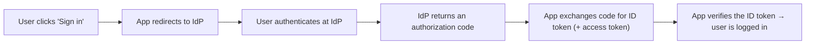

# OIDC 101

> *Type: Guide (101 / foundational) · Audience: novices → developers · Status: **FFP** — next-phase · Track: Security (#19)*
> *How do you log in to lots of apps with one trusted account ("Sign in with…")? OpenID Connect. Read
> [IAM 101](iam-101.md) first. This is an **FFP** capability — the MVP uses its own password login.*

---

## 1. The problem OIDC solves

Every app building its own login is repetitive and risky. **Federated identity** lets a trusted **Identity
Provider (IdP)** handle login once, and many apps rely on it. **OpenID Connect (OIDC)** is the modern standard for
this — the technology behind "Sign in with Google/Microsoft/your-organisation."

OIDC is an **authentication** layer built on top of **OAuth 2.0/2.1** ([OAuth 2.1 + PKCE 101](oauth-2.1-pkce-101.md)).
Slogan: *OAuth is about access; OIDC adds "who is this user?"*

---

## 2. The cast

- **End user** — the person logging in.
- **Relying Party (RP)** — the app trusting the login (IDRM, in FFP).
- **Identity Provider (IdP)** — the trusted authority that authenticates the user (e.g. **Keycloak**, an org's SSO).
- **ID token** — OIDC's key addition: a signed **JWT** ([IAM 101](iam-101.md)) asserting *who the user is*
  (their identity claims).

---

## 3. The flow (simplified)

The app never sees the user's password — only a signed token from the IdP it trusts. Verification uses the IdP's
public key (asymmetric signatures, like IDRM's RS256).

---

## 4. Why IDRM wants it (in FFP)

- **Single Sign-On (SSO)** — government and NGO staff log in with their existing organisational accounts.
- **Central control** — disable one account at the IdP, access is revoked everywhere.
- **Less risk** — IDRM stops storing as many passwords.

**Phasing:** the **MVP** ships its own RS256 JWT password login (simple, self-contained). **FFP** adds OIDC/SSO
through an IdP, integrated at the same session layer — see
[`../../instructions/security.md`](../../../archive/instructions/security.md) and
[`../../idrm-ffp-docs/22-architecture-security-and-iam.md`](../../../docs/ffp/22-architecture-security-and-iam.md).

---

## 5. Mastery check

1. Explain **federated identity** and what problem OIDC solves.
2. Distinguish OIDC (authentication) from OAuth (authorization).
3. Define **IdP**, **Relying Party**, and the **ID token**.
4. Walk through the OIDC login flow at a high level.
5. Say why IDRM adds OIDC in FFP and what the MVP uses instead.

---

## 6. Go deeper

- OpenID Connect — openid.net/connect · Keycloak — keycloak.org · JWT — jwt.io
- Related: [IAM 101](iam-101.md) · [OAuth 2.1 + PKCE 101](oauth-2.1-pkce-101.md) · [MFA 101](mfa-101.md)

---
*Next:* [OAuth 2.1 + PKCE 101](oauth-2.1-pkce-101.md) · *Up:* [Learning Paths](../00-start-learning-paths.md)
