# Role-Mastery — Data Engineer

> *Type: Guide (role-mastery / learning journey) · Audience: data engineer, from novice → mastery · Status: MVP-light (grows in FFP) · Blueprint §25.10*
> *You own data as an asset: modelled well, trustworthy, governed, and — later — analysable. **Phase note:** the
> MVP is a **single PostgreSQL+PostGIS** source of truth; ETL/analytics/data-platform work is largely **FFP**.*

---

## 1. Your mission

Ensure IDRM's data is **correct, consistent, and governed**: sound relational + spatial models, quality
constraints that keep the operational data trustworthy, and — as the system scales — pipelines, lineage, and
analytics that turn operational data into insight without ever compromising the system of record.

## 2. Your mastery map (phase-tagged)

```mermaid
flowchart LR
    A["SQL"] --> B["Relational Modeling"]
    B --> C["PostgreSQL + PostGIS"]
    C --> D["Data Quality"]
    D --> E["Operational Data"]
    E --> F["GIS Data"]
    F --> G["Events (FFP)"]
    G --> H["ETL / ELT (FFP)"]
    H --> I["Lineage (FFP)"]
    I --> J["Governance"]
    J --> K["Analytics (FFP)"]
    K --> L["Data Platform (FFP)"]
    L --> M["Mastery"]
```

*(Blueprint front-loads ETL/analytics; corrected — for IDRM those are **FFP**. MVP data engineering = a clean,
quality-constrained operational model.)*

## 3. Your learning path (rung → what to read)

1. **SQL + relational modeling** → [Database 101](../learn/database-101.md) (keys, CRUD, ACID, indexes)
2. **PostgreSQL + PostGIS** → [PostgreSQL/PostGIS 101](../learn/postgresql-postgis-101.md) ·
   [`50-data-model.md`](../../../docs/mvp/50-data-model.md) · [data-modeling spoke](../../../archive/instructions/data-modeling.md)
3. **Data quality + operational data** → enum/`NOT NULL`/FK constraints; UUID keys; ISO-8601 timestamps; the
   8-state lifecycle as data ([Incident Management 101](../learn/incident-management-101.md))
4. **GIS data** → [GIS for Emergency Response](../learn/gis-for-emergency-response.md) (EPSG:4326, GeoJSON)
5. **Governance** → the **audit** module, data ownership, [security spoke](../../../archive/instructions/security.md) (DPDP
   privacy — data minimisation, no PII where it doesn't belong)
6. **FFP rungs** → [Event-Driven Architecture 101](../learn/event-driven-architecture-101.md) ·
   [caching/messaging spoke](../../../archive/instructions/caching-messaging.md) · [`../../idrm-ffp-docs/50-data-model.md`](../../../docs/ffp/50-data-model.md)
   (per-service data ownership) · [`../../idrm-ffp-docs/81-ops-messaging-and-async.md`](../../../docs/ffp/81-ops-messaging-and-async.md)

## 4. IDRM must-knows

- **One source of truth:** PostgreSQL+PostGIS. Caches/streams (FFP) are **never** authoritative.
- **Migrations only:** schema evolves via **Alembic**, versioned and reviewed.
- **Privacy by design (DPDP Act):** collect the minimum; keep PII out of logs/derived data.

## 5. MVP vs FFP for you

- **MVP:** a clean, constrained, well-indexed operational model in one database.
- **FFP:** per-service data ownership, event streams, ETL/ELT, lineage, and an analytics/decision-support platform
  — added on triggers, with PostGIS staying the system of record.

## 6. Mastery test

You can **model, quality-check, and govern IDRM's operational + spatial data** so it is trustworthy and
privacy-respecting today — and design the pipelines/lineage/analytics that scale it in FFP without undermining the
source of truth.

---
*Related:* [Backend Engineer](backend-engineer.md) · [GIS Engineer](gis-engineer.md) · [Solution Architect](solution-architect.md)
