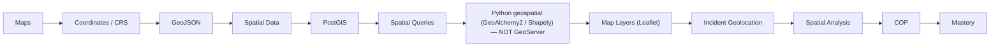

# Role-Mastery — GIS / Geospatial Engineer

> *Type: Guide (role-mastery / learning journey) · Audience: GIS/geospatial dev, from novice → mastery · Status: MVP — current · Blueprint §25.6*
> *IDRM is map-driven; you own the "where." **Important correction:** the blueprint map lists **GeoServer**, but
> IDRM deliberately uses **PostGIS + Python (NO GeoServer)** in the MVP — that rung is corrected below.*

---

## 1. Your mission

Model and query IDRM's spatial data so incidents and resources can be found, filtered, and mapped fast — and so
the map/COP tells responders the truth about "what is where."

## 2. Your mastery map (IDRM-corrected)

## 3. Your learning path (rung → what to read)

1. **Maps + coordinates/CRS + GeoJSON** → [GIS for Emergency Response](../learn/gis-for-emergency-response.md)
   (EPSG:4326, the lat/long-order gotcha, GeoJSON)
2. **Spatial data + PostGIS + spatial queries** → [PostgreSQL/PostGIS 101](../learn/postgresql-postgis-101.md)
   (geometry/geography, GiST indexes, `ST_DWithin`/`ST_Contains`) · [Database 101](../learn/database-101.md)
3. **Data modeling (spatial)** → [`50-data-model.md`](../../../docs/mvp/50-data-model.md) ·
   [data-modeling spoke](../../../archive/instructions/data-modeling.md) (SRID 4326, spatial indexing, validity)
4. **Python geospatial (not GeoServer)** → GeoAlchemy2/Shapely (see [PostGIS 101](../learn/postgresql-postgis-101.md)
   + [data-stores spoke](../../../archive/instructions/data-stores.md)). A dedicated GIS service (GeoPandas/Shapely) is an
   **FFP-only** option, never Java GeoServer.
5. **Map layers + geolocation + COP** → [Common Operational Picture 101](../learn/common-operational-picture-101.md) ·
   [`60-uidesign-web-interaction.md`](../../../docs/mvp/60-uidesign-web-interaction.md) (Leaflet map)
6. **Spatial analysis** → proximity/containment for allocation ([Resource Management 101](../learn/resource-management-101.md))

## 4. The rules you never break

- **CRS discipline:** everything is **EPSG:4326**; watch the GeoJSON `[lng, lat]` order.
- **Native geospatial:** PostGIS does the spatial work in-database; **no GeoServer** in the MVP.
- **Performance:** GiST indexes + bounding-box queries + (frontend) marker clustering — never render everything.
- **Accessibility:** every map capability also has a non-map list path.

## 5. MVP vs FFP for you

- **MVP:** PostGIS in the single database + Leaflet on the web. That covers the pilot.
- **FFP:** a dedicated **Python** geospatial service (GeoPandas/Shapely) *if a trigger needs it*, richer COP
  layers, React-Leaflet — still **not** GeoServer.

## 6. Mastery test

You can **model spatial data correctly (SRID 4326), write efficient PostGIS spatial queries** (proximity,
containment), and **drive the map/COP** from them — explaining why IDRM needs no GeoServer.

---
*Related:* [Backend Engineer](backend-engineer.md) · [Frontend Engineer](frontend-engineer.md) ·
[Data Engineer](data-engineer.md)
