# Role-Mastery — Incident / Operations Manager

> *Type: Guide (role-mastery / learning journey) · Audience: incident/ops manager (coordinator), from novice → mastery · Status: MVP — current · Blueprint §25.11*
> *You run the response. This is a **domain/operational** role — largely non-technical — mapping to IDRM's
> **coordinator/admin**. You use IDRM as your command tool; you don't build it.*

---

## 1. Your mission

Take a disaster from chaos to coordinated response using IDRM: assess the situation, command the effort, allocate
resources, keep everyone informed, close incidents properly, and learn from each event.

## 2. Your mastery map

```mermaid
flowchart LR
    A["Disaster Management"] --> B["Incident Lifecycle"]
    B --> C["IDRM"]
    C --> D["Incident Roles"]
    D --> E["COP"]
    E --> F["Assessment"]
    F --> G["Command"]
    G --> H["Tasking"]
    H --> I["Resource Allocation"]
    I --> J["Communication"]
    J --> K["Escalation"]
    K --> L["Closure"]
    L --> M["After-Action Review"]
    M --> N["Leadership"]
    N --> O["Mastery"]
```

## 3. Your learning path (rung → what to read)

1. **Disaster management + incident lifecycle** → [Disaster Management 101](../learn/disaster-management-101.md) ·
   [Incident Management 101](../learn/incident-management-101.md) (the 8-state lifecycle you drive)
2. **IDRM + incident roles** → the [domain card](../../../archive/instructions/domain.md) (roles, service types, priority) ·
   [`60-uidesign-web-interaction.md`](../../../docs/mvp/60-uidesign-web-interaction.md) (the coordinator screens)
3. **COP + assessment** → [Common Operational Picture 101](../learn/common-operational-picture-101.md) ·
   [Emergency Operations Centre 101](../learn/emergency-operations-centre-101.md)
4. **Command + tasking + resource allocation** → [Incident Command 101](../learn/incident-command-101.md) ·
   [Resource Management 101](../learn/resource-management-101.md) (needs ↔ means; priority + proximity)
5. **Communication + escalation** → [Emergency Communications 101](../learn/emergency-communications-101.md)
   (alerts/notifications)
6. **Closure + after-action** → verify completion; the **audit** trail → After-Action Review ·
   [Disaster Drill / Scenario Testing 101](../learn/disaster-drill-scenario-testing-101.md) (rehearse first)

## 4. What you do in IDRM (as coordinator/admin)

- **Approve** critical incidents; **assign** providers; **verify** completion; **reject** invalid requests.
- Read the **map/COP** to maintain situational awareness; allocate scarce resources by priority + proximity.
- Drive incidents through the lifecycle to `verified`; every action is audited.
- Own the **After-Action Review** so each response improves the next (the disaster lifecycle's learning loop).

## 5. MVP vs FFP for you

- **MVP:** a lean coordinator dashboard + map + the alerts/notifications you need to run the pilot.
- **FFP:** a rich live COP, multi-agency command, advanced analytics, deeper real-time push.

## 6. Mastery test

You can **run the full incident lifecycle in IDRM** — assess → command → task → allocate → communicate →
escalate → close → after-action — and lead a coordinated, multi-responder effort that measurably improves response
time and fulfilment.

---
*Related:* [Product Manager](product-manager.md) · [Technical Support](technical-support.md) ·
[Disaster Management 101](../learn/disaster-management-101.md)
