# Role-Mastery — QA / SDET

> *Type: Guide (role-mastery / learning journey) · Audience: QA / Software Development Engineer in Test, from novice → mastery · Status: MVP — current · Blueprint §25.7*
> *You are the guarantee that IDRM works — and keeps working. Your craft spans from a single unit test to
> rehearsing a whole disaster. In this domain, an escaped bug can mean help that never arrives.*

---

## 1. Your mission

Turn requirements into a layered safety net: fast unit tests, contract-true API tests, integration and E2E
coverage of the critical journeys, plus security, performance, and disaster-drill testing — all automatable so
regressions are caught continuously.

## 2. Your mastery map

```mermaid
flowchart LR
    A["Testing Fundamentals"] --> B["IDRM Requirements"]
    B --> C["Use Cases"]
    C --> D["Test Design"]
    D --> E["API Testing"]
    E --> F["Database Testing"]
    F --> G["Automation"]
    G --> H["Integration"]
    H --> I["E2E"]
    I --> J["Security"]
    J --> K["Performance"]
    K --> L["Resilience"]
    L --> M["Disaster Drills"]
    M --> N["Mastery"]
```

## 3. Your learning path (rung → what to read)

1. **Testing fundamentals + test design** → [Testing 101](../learn/testing-101.md) (pyramid, Arrange-Act-Assert,
   coverage-as-a-floor)
2. **IDRM requirements + use cases** → [`11-requirements-scope-and-acceptance.md`](../../../docs/mvp/11-requirements-scope-and-acceptance.md)
   (Feature→Req→Acceptance→Test) · [Incident Management 101](../learn/incident-management-101.md) (lifecycle + failure cases)
3. **API + database testing** → [API Testing 101](../learn/api-testing-101.md) (positive+negative, per-role,
   OpenAPI contract testing) · [Database 101](../learn/database-101.md)
4. **Automation + E2E** → [E2E Testing 101](../learn/e2e-testing-101.md) (Playwright, critical journeys) ·
   [`70-quality-test-strategy.md`](../../../docs/mvp/70-quality-test-strategy.md) (the plan + coverage gates)
5. **Security testing** → [Security Testing 101](../learn/security-testing-101.md) ·
   [RBAC/ABAC 101](../learn/rbac-abac-101.md) (test every endpoint under every role)
6. **Performance + resilience + drills** → [Performance Testing 101](../learn/performance-testing-101.md) ·
   [Disaster Drill / Scenario Testing 101](../learn/disaster-drill-scenario-testing-101.md) ·
   [Accessibility Testing 101](../learn/accessibility-testing-101.md)

## 4. What you specifically prove for IDRM

- The **8-state lifecycle** rejects illegal transitions (e.g. `created → verified`).
- **RBAC** holds: a citizen *cannot* verify; a provider *cannot* approve critical.
- The **API contract** never drifts (OpenAPI contract tests).
- **Accessibility**: the map has a working list alternative; keyboard/screen-reader journeys pass.
- Under **surge load** and **injected failure**, the system degrades gracefully.

## 5. MVP vs FFP for you

- **MVP:** pytest unit/API/integration + basic E2E, a11y, and seeded disaster drills; CI gate at the strategy's
  coverage floor.
- **FFP:** DAST/pen testing, full performance suites, chaos engineering, DORA metrics.

## 6. Mastery test

You can **design tests from a requirement all the way through E2E, security, performance, and resilience/disaster
drills** — automated where possible — and say with evidence whether a release is safe to ship.

---
*Related:* [Business Analyst](business-analyst.md) · [Backend Engineer](backend-engineer.md) ·
[Security Engineer](security-engineer.md) · [DevOps / SRE](devops-sre.md)
