# Role-Mastery — Technical / Application Support

> *Type: Guide (role-mastery / learning journey) · Audience: application support, from novice → mastery · Status: MVP — current · Blueprint §25.12*
> *You are the first responder for the *software*: when a user hits a problem, you triage it, fix or route it, and
> make sure it doesn't recur. You need broad system literacy, not deep coding.*

---

## 1. Your mission

Keep IDRM usable day-to-day: understand the system well enough to triage issues from logs and dashboards, resolve
the known ones with runbooks, escalate the rest cleanly, and drive root-cause fixes so problems don't come back.

## 2. Your mastery map

```mermaid
flowchart LR
    A["IDRM Orientation"] --> B["Architecture"]
    B --> C["IAM"]
    C --> D["Logs"]
    D --> E["Dashboards"]
    E --> F["Common Failures"]
    F --> G["Runbooks"]
    G --> H["Incident Triage"]
    H --> I["Escalation"]
    I --> J["Recovery"]
    J --> K["RCA"]
    K --> L["Problem Management"]
    L --> M["Mastery"]
```

## 3. Your learning path (rung → what to read)

1. **IDRM orientation + architecture** → [Learning Paths](../00-start-learning-paths.md) ·
   [Disaster Management 101](../learn/disaster-management-101.md) · the [domain card](../../../archive/instructions/domain.md) ·
   [`20-architecture-system.md`](../../../docs/mvp/20-architecture-system.md)
2. **IAM (for access issues)** → [IAM 101](../learn/iam-101.md) · [RBAC/ABAC 101](../learn/rbac-abac-101.md)
   (most "I can't do X" tickets are role/permission questions)
3. **Logs + dashboards** → [Observability 101](../learn/observability-101.md) ·
   [Monitoring 101](../learn/monitoring-101.md) · [Linux 101](../learn/linux-101.md) (journalctl to read service logs)
4. **Common failures + runbooks** → [Incident Response 101](../learn/incident-response-101.md) (severity,
   runbooks, blameless RCA) · [`80-ops-deployment-and-operations.md`](../../../docs/mvp/80-ops-deployment-and-operations.md)
5. **Triage + escalation + recovery** → know what you can fix vs. when to escalate to DevOps/SRE ·
   [Backup & Restore 101](../learn/backup-restore-101.md) (recovery basics)
6. **RCA + problem management** → distinguish an **incident** (fix now) from a **problem** (recurring root cause to
   eliminate)

## 4. Everyday IDRM support knowledge

- **Terminology bridge:** users say **"help request"**; the system calls it an **`incident`** — and note the
  naming clash between a *disaster* help request and an *operational* (system) incident.
- **Access tickets:** usually RBAC — check the user's role vs. the action.
- **Read the signals:** `/health`, `/ready`, logs (`journalctl -u idrm`), dashboards — before guessing.
- **Runbooks first:** follow the written steps for known failures; don't improvise under pressure.

## 5. MVP vs FFP for you

- **MVP:** support the single app on native systemd — logs via journalctl, a few runbooks, escalate to
  DevOps/SRE for infra.
- **FFP:** support a distributed system — richer dashboards, per-service logs/traces, formal ticketing and on-call.

## 6. Mastery test

You can **triage an IDRM issue from logs/dashboards, resolve known failures via runbooks, escalate the rest with
clear context, and drive an RCA** so the same problem doesn't return.

---
*Related:* [DevOps / SRE](devops-sre.md) · [Incident/Ops Manager](incident-ops-manager.md) · [Security Engineer](security-engineer.md)
